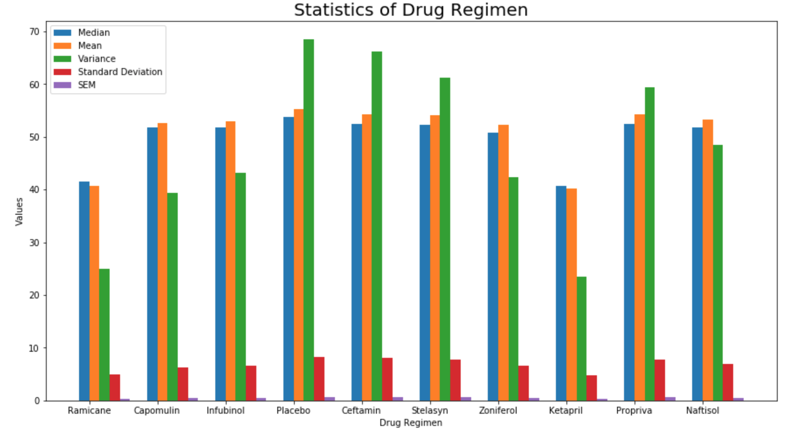

# Pymaceuticals Analysis

## Introduction

In this study, 250 mice identified with SCC tumor growth were treated through a variety of drug regimens. Over the course of 45 days, tumor development was observed and measured. The purpose of this study was to compare the performance of Pymaceuticals' drug of interest, Capomulin, versus the other treatment regimens. A technical report of the study was generated with all the tables and figures needed.

### Tools

The following tools were used to do the analysis and the REST API

+ Python
    + Pandas
    + Matplotlib
    + Scipy
    + Random
- Jupyter Notebook

## Data

The information used is from the years 2016, 2017 and 2018 and is in a SQLite database and in .json format files, these can be found in the "Resources" folder, this was provided by Tecnológico de Monterrey.
With this the analysis was performed as well as the REST API
SQLite Database

#### Mouse_metadata Table

|     Column    | Data Type |
| ------------- | ----------|
|    Mouseid    |   `str`   |
|  Drug_Regimen |   `str`   |
|      Sex      |   `str`   |
|   Age_Months  |   `int`   |
|    Weight(g)  |   `int`   |

- Mouseid      -> Mouse unique id code
- Drug_Regimen -> Drug Name
- Sex          -> Gender of Mouse
- Age_Months   -> Age of Mouse
- Weight(g)    -> Weight of the mouse in grams

#### Study_results Table

|     Column        | Data Type |
| ----------------- | ----------|
|     Mouseid       |   `str`   |
|    Timepoint      |   `int`   |
| Tumor_Volume(mm3) |  `float`  |
| Metastatic_Sites  |   `int`   |

- Mouseid            -> Mouse unique id code
- Timepoint          -> Timepoint of mouse checks
- Tumor_Volume(mm3)  -> Volumen of the tumor
- Metastatic_Sites   -> Matastatic number

## Analysis

When the information was analyzed with the help of the generated graphs, the conclusion of 3 important findings was reached, which are the following:

1. Capomulin is one of the best drugs to treat the Tumor Volume (mm3) because the tumors decrease significantly 
2. We can said that there is a direct relationship between weight and the volume of the tumor, with this we can said that  the heavier the mouse the bigger the tumor
3. The gender of the mices do not affect the decrease or increase of tumors in the treatments